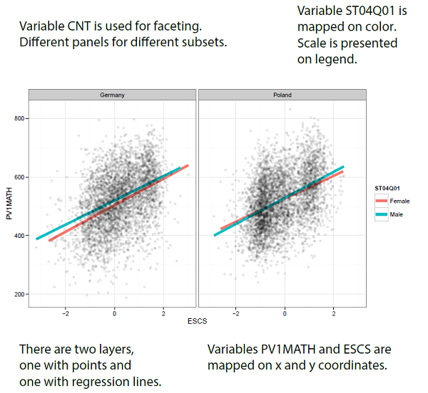
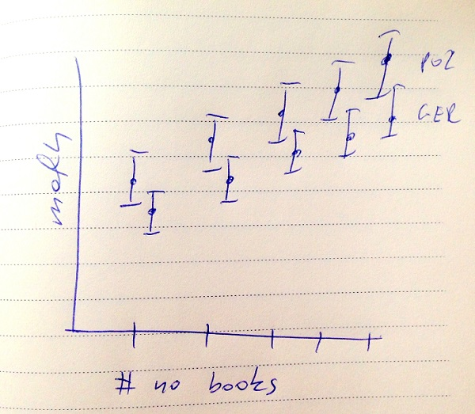
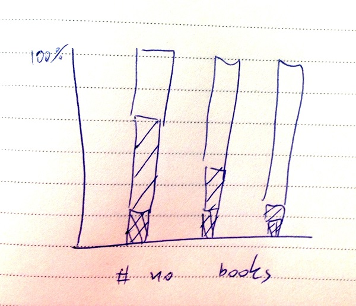

# Introduction to ggplot2

### Data preparation
We will use dplyr library to preprocess the pisa data. Feel free to use any other package you like.

First, let's calculate weighted average performance in different countries.
Resulting data.frame 'avgs' has four columns with country name, subject averages, and total population of kids in a given country.

```{r fig.width=5, fig.height=5, warning=FALSE, message=FALSE}

library(dplyr)
load("PISAeurope.rda")

avgs <- pisa %>% 
          group_by(CNT) %>% 
          summarise(math = weighted.mean(PV1MATH, W_FSTUWT, na.rm = TRUE),
                    read = weighted.mean(PV1READ, W_FSTUWT, na.rm = TRUE),
                    total = sum(W_FSTUWT)) 
avgs

```

## Basics of ggplot2

### First plot in ggplot

There are two functions in ggplot2 package that create plots
 
- the easy way is to use qplot function (q like quick), 
- the powerful way is through ggplot(), slightly less intuitive, up to the point when your intuition change. 
 
Since we are professionals we are going to work with ggplot().

Let's start with scatterplot.

```{r fig.width=5, fig.height=5, warning=FALSE, message=FALSE}

library(ggplot2)
ggplot(avgs, aes(x=math, y=read)) +
    geom_point() + 
    ggtitle("Average PISA scores for different countries")

```

First we specify data set and aesthetic mappings (see aes()  function) then we add more information like geometries of other properties.

The ggplot graphics is told to be *'high quality elegant graphics'*.

Let' find out why.

Compare with plot from base graphics, both with default settings.
Both plots are fitted in a single square canvas 4x4 inches.

```{r fig.width=4, fig.height=4, warning=FALSE, message=FALSE, fig.show='hold'}

plot(avgs$read, avgs$math)              # base graphics
ggplot(avgs, aes(x=math, y=read)) +     # ggplot graphics
    geom_point()

```

## Your turn
Find at last 3 differences.

 - 

 - 
 
 -

## Key components



- geoms: geometry of the plot, like points, lines, maps
- aesthetic mappings: how data variables are mapped to plot properties
- scales: domain of aesthetic mappings
- facets: conditional plots
- coordinate system of the plot


## Geometry

The usual way is, first, to specify data source, second, to specify mappings of variables onto plot ascetics and then define geometry (one or more) of the plot.

There are many geometries to choose from, see http://docs.ggplot2.org/current/. We are going to work with few most common, you can work with other in similar fashion.

### For two continuous variables

Let's look closer into these three geoms: geom_point(), geom_text(), geom_smooth().

Here http://docs.ggplot2.org/current/geom_text.html, you can find list of aesthetics that can be mapped.

Three obligatory are x, y, and label.

```{r fig.width=5, fig.height=5, warning=FALSE, message=FALSE}

ggplot(avgs, aes(x=math, y=read, label=CNT)) +
  geom_text()

```

What about size? 
Let's use the 'total' number of students to show size of the country (number of pupils).

```{r fig.width=5, fig.height=5, warning=FALSE, message=FALSE}

ggplot(avgs, aes(x=math, y=read, label=CNT, size = total)) +
  geom_text()
ggplot(avgs, aes(x=math, y=read, label=CNT)) + # same result, local mapping
  geom_text(aes(size = total))

# do not like the scientific notation in legend? 
# change scale
library(scales)
ggplot(avgs, aes(x=math, y=read, label=CNT)) +
  geom_text(aes(size=total)) +
  scale_size_continuous(labels = comma)

# Mapping of a single value is not a mapping
ggplot(avgs, aes(x=math, y=read, label=CNT, size = 5)) + 
  geom_text()

# ggplot(avgs, aes(x=math, y=read, label=CNT)) +
  geom_text(size = 5)

```

## Your turn

Use geom_text() or/and geom_smooth() to show the relation between size of the country (variable total) and performance in reading or math.


### geom_smooth()

One of nicest geoms for people that work with regression models is geom_smooth()

Why?

Let's see the relation between performance in math and wealth of the family.

```{r fig.width=5, fig.height=5, warning=FALSE, message=FALSE}

  pol <- pisa %>% filter(CNT == 'Poland')

  ggplot(pol, aes(x=ESCS, y=PV1MATH)) +
    geom_smooth() 

```

Let's remove the CI and add points.

```{r fig.width=5, fig.height=5, warning=FALSE, message=FALSE}

  ggplot(pol, aes(x=ESCS, y=PV1MATH)) +
    geom_point() +
    geom_smooth(se = FALSE, size=5) 

```

Note that geom_smooth() not only smooths.  You can specify other regression models as well

```{r fig.width=5, fig.height=5, warning=FALSE, message=FALSE}

  ggplot(pol, aes(x=ESCS, y=PV1MATH)) +
    geom_point(alpha=0.4) +
    geom_smooth(se = FALSE, size=2) +
    geom_smooth(se = FALSE, size=2, method = "lm", colour="red") +
    geom_smooth(se = FALSE, size=2, method = "lm", colour="green", formula = y ~ poly(x,2)) 

```
Change the smoothing window

```{r fig.width=5, fig.height=5, warning=FALSE, message=FALSE}

  ggplot(pol, aes(x=ESCS, y=PV1MATH)) +
    geom_point(alpha=0.4) +
    geom_smooth(se = FALSE, size=2, colour="blue", span=0.9, method="loess") +
    geom_smooth(se = FALSE, size=2, colour="red", span=0.1, method="loess") 

```
Can be combined with other ascetics.
This can be powerful mechanism.

```{r fig.width=5, fig.height=5, warning=FALSE, message=FALSE}

  ggplot(pisa, aes(x=ESCS, y=PV1MATH)) +
    geom_smooth(aes(colour=CNT), se = FALSE, size=2, method = "lm") 

```

### Your turn

The ST28Q01 variable stands for 'How many books are there in your home?'

Plot the relation between math and reading in groups defined by  ST28Q01 variable.

Add smooth or other geoms.


### For categorical variables

Barplots and their's variations are useful when playing with categorical variables. The geom_bar() is a good example.

The PISA question:

*Suppose that you have been sending text messages from your mobile phone for several weeks. Today, however, you can't send text messages. You want to try to solve the problem. What would you do?*


```{r fig.width=5, fig.height=5, warning=FALSE, message=FALSE}

ggplot(pol, aes(x=ST96Q01)) +
  geom_bar() +
  ggtitle("I press every button possible to find out what is wrong")

# Do not like NA's? Let's filter them out
pol %>% filter(!is.na(ST96Q01)) %>% 
  ggplot( aes(x=ST96Q01)) +
    geom_bar() +
    ggtitle("I press every button possible to find out what is wrong")

# horizontal or vertical?
pol %>% filter(!is.na(ST96Q01)) %>% 
  ggplot( aes(x=ST96Q01)) +
    geom_bar() +
    coord_flip() +
    ggtitle("I press every button possible to find out what is wrong")

```

Note that there are many interesting parameters for geom_bar()
http://docs.ggplot2.org/current/geom_bar.html. 

One of them is 'position'.

```{r fig.width=5, fig.height=5, warning=FALSE, message=FALSE}

  pol %>% filter(!is.na(ST96Q01)) %>% 
    ggplot(aes(x=ST96Q01, fill=ST04Q01)) +
    geom_bar() +
    ggtitle("I press every button possible to find out what is wrong") +
    coord_flip()

# Position = dodge, stand one by one
pol %>% filter(!is.na(ST96Q01)) %>% 
    ggplot(aes(x=ST96Q01, fill=ST04Q01)) +
    geom_bar(position="dodge") +
    ggtitle("I press every button possible to find out what is wrong") +
    coord_flip()

# Position = fill, relative counts
pol %>% filter(!is.na(ST96Q01)) %>% 
    ggplot(aes(x=ST96Q01, fill=ST04Q01)) +
    geom_bar(position="fill") +
    ggtitle("I press every button possible to find out what is wrong") +
    coord_flip()

# Like percentages on scale y (note that coords are flipped)?
pol %>% filter(!is.na(ST96Q01)) %>% 
    ggplot(aes(x=ST96Q01, fill=ST04Q01)) +
    geom_bar(position="fill") +
    ggtitle("I press every button possible to find out what is wrong") +
    coord_flip() +
    scale_y_continuous(label=percent)

```

### Your turn

The ST28Q01 variable stands for 'How many books are there in your home?'.

The ST04Q01 stands for gender, CNT for country.

Plot the relation between gender and number of books in home.

Try different 'position' options.

### Other geometries
List of all geometries is changing. See http://docs.ggplot2.org/current/ for geometries available in the current version of ggplot2.

```{r fig.width=5, fig.height=5, warning=FALSE, message=FALSE}

pol %>% ggplot(aes(y=PV1MATH, x=ST04Q01)) +
  geom_boxplot() 

pol %>% ggplot(aes(x=PV1MATH, fill=ST04Q01)) +
  geom_density() 

pol %>% ggplot(aes(x=PV1MATH, fill=ST04Q01)) +
  geom_density(alpha=0.5) 

pol %>% ggplot(aes(PV1MATH)) +
  geom_histogram() 

```

## Theme

Up to this point you might feel sick of the gray background.
(Note that it has some advantages).

Do not worry! You have a choice, you can change a theme of the plot.

```{r fig.width=5, fig.height=5, warning=FALSE, message=FALSE}

ggplot(avgs, aes(x=math, y=read, label=CNT)) +
  geom_text()

ggplot(avgs, aes(x=math, y=read, label=CNT)) +
  geom_text() + 
  theme_bw()

```

Two is not that very big choice.

But you can create your own themes! 

Or use themes created by others.


```{r fig.width=5, fig.height=5, warning=FALSE, message=FALSE}

library(ggthemes)
# a theme replicating the classic ugly gray charts in Excel
ggplot(avgs, aes(x=math, y=read, label=CNT)) +
  geom_text() + 
  theme_excel()
# a minimal ink based on Tufte's The Visual Display of Quantitative Information.
ggplot(avgs, aes(x=math, y=read, label=CNT)) +
  geom_text() + 
  theme_tufte()
# a theme solarized
ggplot(avgs, aes(x=math, y=read, label=CNT)) +
  geom_text() + 
  theme_solarized()
# a theme dark
ggplot(avgs, aes(x=math, y=read, label=CNT)) +
  geom_text() + 
  theme_solarized(light = FALSE)

```

## Your turn

See how your previous plots looks in different themes.

You can find more themes on the internet. 


### Data preparation
We will use dplyr library to preprocess the pisa data. Feel free to use any other package you like.

First, let's calculate weighted average performance in different countries.
Resulting data.frame 'avgs' has four columns with country name, subject averages, and total population of kids in a given country.


## Use case 1

Problem:

Impact of country and number_of_book_in_home on pupil's performance.

Possible solution:

For two countries, e.g. POL and GER, plot average performance, and add error bars +- 2 x se around average.



```{r fig.width=7, fig.height=5, warning=FALSE, message=FALSE}

#
# for each country and number of books we need
# - average weighted performance
# - lower and upper bound for errorbars

avgs <- 
  pisa %>% 
     filter(CNT %in% c('Poland', 'Germany')) %>%
     group_by(CNT, ST28Q01) %>%
     summarise(math = mean(PV1MATH, na.rm=TRUE),
               sd = sqrt(var(PV1MATH, na.rm=TRUE)),
               n = n(),
               lmath = math - 1.96* sd/sqrt(n),
               umath = math + 1.96* sd/sqrt(n))
avgs <- na.omit(avgs)

# let's combine errorbar and point geoms

ggplot(avgs, aes(x=ST28Q01, y=math, colour=CNT)) + 
    geom_errorbar(aes(ymin=lmath, ymax=umath)) +
    geom_point()

# some tuning

ggplot(avgs, aes(x=ST28Q01, y=math, colour=CNT)) + 
    geom_errorbar(aes(ymin=lmath, ymax=umath), 
        width=0.2, 
        position=position_dodge(.2)) +
    geom_point(
        position=position_dodge(.2)) + 
    coord_flip() + 
    theme(panel.grid.major.y=element_blank())

```

## Use case 2

Problem:

Show the relation between performance and number_of_book_in_home but performance should be categorized.

Possible solution:

Barchart with proportion of top/middle/bottom performers in different 'books_in_home' categories.



```{r fig.width=7, fig.height=5, warning=FALSE, message=FALSE}
# performance is categorized with 400 and 600 cutoffs
# need weighted proportions of pupils within each ST28Q01 category

pol <- pisa %>% filter(CNT == 'Poland')

props <- 
  pol %>% 
     mutate(mat_cat = cut(PV1MATH, c(0, 400, 600, 1000))) %>%
     group_by(ST28Q01, mat_cat) %>%
     summarise(total = sum(W_FSTUWT, na.rm=TRUE))
mprops <- 
  props %>%
  group_by(ST28Q01) %>%
  mutate(mtotal = total / sum(total))               

#
# now it's just application of geom_bar()
ggplot(mprops, aes(x=ST28Q01, y=mtotal, fill=mat_cat)) +
  geom_bar(stat='identity', position='dodge', alpha=0.5) 

ggplot(mprops, aes(x=ST28Q01, y=mtotal, fill=mat_cat)) +
  geom_bar(stat='identity', position='fill', alpha=0.5) +
   theme(axis.text.x = element_text(angle=90, hjust=1)) 

```

### Annotations
Use following functions to add title, name for x or y axis. Or change the limits for x or y axis.

- ggtitle()
- xlab()
- ylab()
- xlim()
- xlim()

## Your turn

Work on your PISA story.

Start with one or two sketches.

Then figure out what geoms will be required and what kind of data aggregates you need to prepare.

Then try to do this in ggplot2.


## Facets

Using ascetics like size, color, shape is great when you want to have many groups on a single plot. 

Sometimes it is useful to present different plots on different panels. Facets are handy for that.

```{r fig.width=7, fig.height=5, warning=FALSE, message=FALSE}

  ggplot(pol, aes(x=ESCS, y=PV1MATH)) +
    geom_smooth(aes(colour=ST04Q01), se = FALSE, size=2, method = "lm") +
    geom_point()

  ggplot(pol, aes(x=ESCS, y=PV1MATH)) +
    geom_smooth(se = FALSE, size=2, method = "lm") + 
    geom_point() + 
    facet_wrap(~ST04Q01)

```

You can arrange panels in grid of wrapped list, choose one of facet_wrap(), facet_grid() or others. And choose wisely.

```{r fig.width=7, fig.height=5, warning=FALSE, message=FALSE}

ggplot(pisa, aes(x=ST96Q01)) +
  geom_bar(position="dodge") +
  ggtitle("I press every button possible to find out what is wrong") +
  coord_flip() + 
  facet_grid(ST04Q01~CNT)

```

### Your turn!

Apply facets to the plot that you have created for your PISA story.

## Ascetics and scales

Let's play with ascetics mapping and scales. First, prepare a data set with two grouping variables.

```{r fig.width=7, fig.height=5, warning=FALSE, message=FALSE}
genderAvgs <- pisa %>% 
          group_by(CNT, ST04Q01) %>% 
          summarise(math = weighted.mean(PV1MATH, W_FSTUWT, na.rm = TRUE),
                    read = weighted.mean(PV1READ, W_FSTUWT, na.rm = TRUE),
                    total = sum(W_FSTUWT)) 
head(genderAvgs)

```

For geom_point() we can set color, shape and size.

```{r fig.width=7, fig.height=5, warning=FALSE, message=FALSE}
ggplot(genderAvgs, aes(x=math, y=read, size=total, shape=ST04Q01, colour=ST04Q01)) +
    geom_point() 

```

Not how scales are related to the variable being presented.

```{r fig.width=7, fig.height=5, warning=FALSE, message=FALSE}

ggplot(genderAvgs, aes(x=math, y=read, size=ST04Q01, shape=ST04Q01, colour=total)) +
    geom_point() 

```

Sometime ggplot2 cannot construct good mapping. We have to do this on our own.

```{r fig.width=7, fig.height=5, warning=FALSE, message=FALSE}

# Problem with number of levels
ggplot(genderAvgs, aes(x=math, y=read, shape=CNT, colour=ST04Q01)) +
    geom_point() 

ggplot(genderAvgs, aes(x=math, y=read, shape=CNT, colour=ST04Q01)) +
    geom_point(size=3) +
  scale_shape_manual(values=LETTERS[1:10])

```

In similar way we can affect other ascetics.

```{r fig.width=7, fig.height=5, warning=FALSE, message=FALSE}

ggplot(genderAvgs, aes(x=math, y=read, shape=CNT, colour=ST04Q01)) +
    geom_point(size=3) +
  scale_shape_manual(values=LETTERS[1:10]) + 
  scale_y_continuous(trans="log2", limits=c(200,1050)) 

ggplot(genderAvgs, aes(x=math, y=read, shape=CNT, colour=ST04Q01)) +
    geom_point(size=3) +
  scale_shape_manual(values=LETTERS[1:10]) + 
  scale_color_brewer(palette="Paired")

```

Any other color scale?

```{r fig.width=7, fig.height=5, warning=FALSE, message=FALSE}
# More Brewer scales
library(RColorBrewer)
display.brewer.all()

```

 Note, that in our case both axes seems to be in same units.
 Maybe plot should be forced to keep proportions.
 
```{r fig.width=7, fig.height=5, warning=FALSE, message=FALSE}

ggplot(genderAvgs, aes(x=math, y=read, shape=CNT, colour=ST04Q01)) +
    geom_point(size=3) +
  scale_shape_manual(values=LETTERS[1:10]) + 
  coord_equal()

```

### Example: How to change name  in legend
Based on http://www.cookbook-r.com/Graphs/Legends_(ggplot2)

```{r fig.width=7, fig.height=5, warning=FALSE, message=FALSE}

# Before
ggplot(pol, aes(x=ST96Q01, fill=ST04Q01)) +
    geom_bar(position="fill") 

# After
ggplot(pol, aes(x=ST96Q01, fill=ST04Q01)) +
    geom_bar(position="fill") + 
    scale_fill_discrete(name="Gender")

ggplot(pol, aes(x=ST96Q01, fill=ST04Q01)) +
    geom_bar(position="fill")  + 
    scale_fill_manual(name="Gender", 
                      values=c("red", "blue"), 
                      labels=c("Girl", "Boy"))

# can be used to reorder levels

ggplot(pol, aes(x=ST96Q01, fill=ST04Q01)) +
    geom_bar(position="fill") + 
    scale_x_discrete(limits = rev(levels(pol$ST96Q01)))
    
```

## Some technical issues

Few technical remarks. 
In ggplot2 everything is an object. So, plot is an object, as well. You can store it, copy or modify it.

```{r fig.width=7, fig.height=5, warning=FALSE, message=FALSE}

ob <- ggplot(genderAvgs, aes(x=math, y=read, shape=CNT, colour=ST04Q01)) +
          geom_point(size=3) +
            scale_shape_manual(values=LETTERS[1:10]) + 
            coord_equal()

summary(ob)
print(ob)
plot(ob)
save(ob, file="samplePlot.rda")

```

The ggplot2 package is using grid graphics.
So you can use grid graphics function for modification of arrangement of ggplot's.

```{r fig.width=7, fig.height=5, warning=FALSE, message=FALSE}

library(gridExtra)
library(grid)
grid.newpage() 
print(ob, vp=viewport(x=0.5, y = 0.5, 
                          width=1, height=1))
print(ggplot(genderAvgs, aes(x=math, y=read)) + geom_point() + theme_bw(), 
      vp=viewport(x=0.8, y = 0.8, 
                          width=0.4, height=0.4))

```

### Your turn!

Add some annotations to your plot and save it as pdf or png file with the ggsave() function.


## Other sources

- great book 'Cookbook for R', http://www.cookbook-r.com/Graphs/
- ggplot2 documentation, http://docs.ggplot2.org/current/
- webinars like 'The Grammar and Graphics of Data Science' http://pages.rstudio.net/Webniar-Series-Essential-Tools-for-R.html
- Introduction to dplyr http://cran.rstudio.com/web/packages/dplyr/vignettes/introduction.html