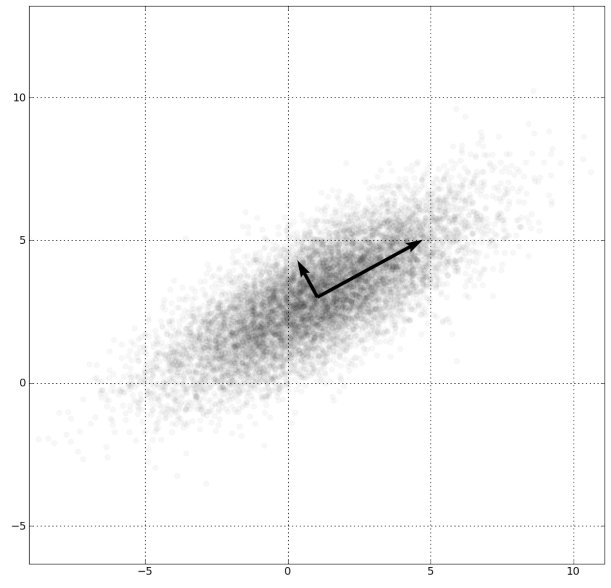

# Association rules

```{r, message=FALSE, warning=FALSE}
library(dplyr)
```

## Introduction

Let Z be the set of items and X, Y be a subsets of Z, called itemsets. 

A rule has form X -> Y.

We will use three measures that summarise a rule or it's itemsets.

`Support` of an itemset X is the percentage of transactions covered by X. If n is the number of all transactions and n_X transactions in X then

`supp(X) = n_X/n`

`Confidence` of a rule is the percentage of transactions with Y in all transactions covred by X.

`conf(X -> Y)` = `supp(X+Y) / supp(X)`


`Lift` is a measure of deviation from statistical independence. It takes value 1 if X and Y are independent and values greater than 1 for positive dependence.

`lift(X -> Y)` = `conf(X -> Y) / supp(Y)` = `supp(X+Y)/(supp(X) supp(Y))`


A good rule should has high support and high confidence. Usually we apply some filters for `supp(X+Y)` and `cond(X -> Y)`.

The procedure how to find frequent itemsets and good rules is non trivial. See for example a very good description http://michael.hahsler.net/research/arules_RUG_2015/demo/ and http://michael.hahsler.net/research/arules_RUG_2015/talk/arules_RUG2015.pdf

## Basic Example

We will use `apriori` function from `arules` package to find rules based on `Groceries` dataset. 

Let's see how the data is stored (sparse matrix).

```{r, message=FALSE, warning=FALSE}
library("arules")
data("Groceries")
Groceries
inspect(Groceries[1:5])
itemFrequency(Groceries[, 1:3])

head(Groceries@itemInfo)
head(Groceries@data,5)

image(head(Groceries,300))

itemFrequencyPlot(Groceries, support = 0.1)
itemFrequencyPlot(Groceries, topN=20)

image(sample(Groceries, 100))
```

Now we can extract some rules.

```{r, message=FALSE, warning=FALSE}
groceryrules <- apriori(Groceries, parameter = list(support =
                            0.006, confidence = 0.25, minlen = 2))
groceryrules
inspect(groceryrules[1:3])

rules <- apriori(Groceries, parameter = list(support = .001))
rules
inspect(head(sort(rules, by = "lift"), 3))

berryrules <- subset(groceryrules, items %in% "berries")
inspect(berryrules)
```

Your turn: change parameters to have rules with confidence > 0.9.

```{r}

```
## A bit more complicated example

Let's try to apply this approach to our dataset.

We need to convert data about visited stations into the matrix with transactions.

```{r, message=FALSE, warning=FALSE}
load("trans.rda")

#trans <- verySmallLogs %>%
#  group_by(visitor) %>%
#  summarise(path = paste(sort(unique(substr(grep(station, pattern="^[^1]", value=TRUE), 1, #5))), collapse=";"))

#save(trans, file="trans.rda")
head(trans,10)
```

For each visitor we have stations that have been visited. Let's convert this data into a list of vectors. This format is supported by the `apriori` function.

```{r, message=FALSE, warning=FALSE}
listTrans <- strsplit(as.character(as.data.frame(trans)[,2]), split=";")
names(listTrans) <- paste0("U",as.data.frame(trans)[,1])
head(listTrans)

# convert into transactions
trans1 <- as(listTrans, "transactions")
summary(trans1)
image(head(trans1,20))
```

Now we are ready to mine rules in such dataset. In order to speed up the process we can add additional restrictions for maximum size of itemsets.

```{r, message=FALSE, warning=FALSE}
rules <- apriori(trans1, parameter = list(support = .001, maxlen=10, confidence=0.7))

rules
inspect(head(sort(rules, by = "lift"), 10))
inspect(head(sort(rules, by = "support"), 10))
```

Our rules have very small support.

We can train them on much larger dataset to get larger support.

# Multidimensional scaling

Working with high dimensional data we are unable to properly visualise the dataset or sometimes our methods are not capable to deal with too high dimension. 

So we may use some techniques to reduce the dimension in our data.

## Principal Components Analysis

### Introduction

The most basic technique is PCA.
It' goal is to find another parameterisation of the whole space in which variance in the data is highest in consecutive dimensions.
Then usually only first two or three dimensions in the new dataset is left.

Important: New variables are orthogonal and are linear transformations of the original variables. 

In R it's implemented in two function `princomp` (uses the eigen value decomposition) and `prcomp` (uses SVD decomposition).



### Basic example

Let us start with an example

```{r}
head(USArrests)

pca1 <- prcomp(USArrests, scale = TRUE)
summary(pca1)
names(pca1)
```
The `center` and `scale` are used for scaling before implementing PCA.
The `rotation` matrix consists of principal componnets loadings. Each column contains principal component loading vector.
The `x` matrix contains principal component score vectors. The `sdev` includes the standard deviations of each principal components. The variance explained by each PC is obtained by squaring this value.
```{r}
biplot(pca1,scale=0)
var <- pca1$sdev^2
pve =var /sum(var)
plot(pve, xlab="Principal Component", ylab="Proportion of Variance Explained", ylim=c(0,1), type='b')

plot(cumsum(pve), xlab="Principal Component", ylab="Cumulative Proportion of Variance Explained", ylim=c(0,1), type='b')

pca <- princomp(~ Murder + Assault + UrbanPop,
                  data = USArrests, cor = TRUE)
summary(pca)
pca$scores[1:5, ]
plot(pca)
biplot(pca)
pca$loadings
```
